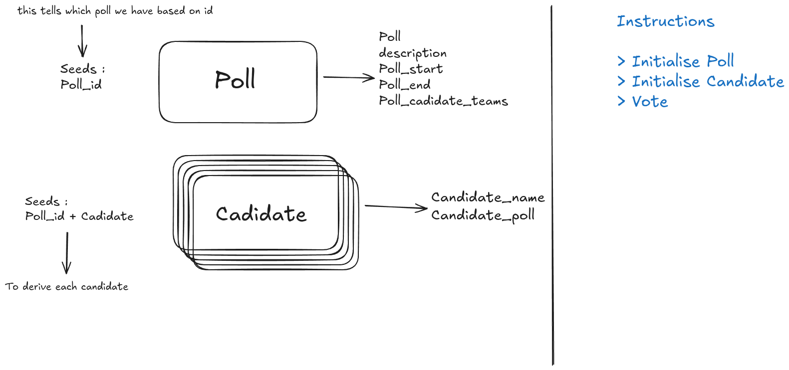

# Solana Voting DApp

A decentralized voting application built on the Solana blockchain using Anchor framework. This application allows users to create polls, add candidates, and vote in a transparent and immutable manner.

## Features

- **Poll Creation**: Initialize polls with custom descriptions and time periods
- **Candidate Management**: Add candidates to existing polls
- **Voting System**: Cast votes for candidates within active poll periods
- **Time-based Validation**: Polls have start and end times for controlled voting periods
- **Decentralized**: Built on Solana blockchain for transparency and immutability

## Architecture



The application consists of:
- **Solana Program**: Smart contract handling poll logic ([`programs/voting-app/src/lib.rs`](programs/voting-app/src/lib.rs))
- **Client Tests**: TypeScript tests demonstrating usage ([`tests/voting-app.ts`](tests/voting-app.ts))

## Program Structure

### Instructions

1. **`initialize_poll`**: Creates a new poll with description and time bounds
2. **`initialize_candidate`**: Adds a candidate to an existing poll
3. **`vote`**: Casts a vote for a candidate (with time validation)

### Accounts

- **`Poll`**: Stores poll metadata (ID, description, start/end times, candidate count)
- **`Candidate`**: Stores candidate information (name, vote count)

### Account Derivation

- Poll PDA: `[poll_id.to_le_bytes()]`
- Candidate PDA: `[poll_id.to_le_bytes(), candidate_name.as_bytes()]`

## Prerequisites

- [Rust](https://rustup.rs/) (latest stable version)
- [Node.js](https://nodejs.org/) (v16 or higher)
- [Solana CLI](https://docs.solana.com/cli/install-solana-cli-tools)
- [Anchor CLI](https://www.anchor-lang.com/docs/installation) (v0.30.1)

## Setup

1. **Clone the repository**
   ```bash
   git clone <repository-url>
   cd voting-app
   ```

2. **Install dependencies**
   ```bash
   npm install
   ```

3. **Build the program**
   ```bash
   anchor build
   ```

4. **Start local validator** (in a separate terminal)
   ```bash
   solana-test-validator
   ```

5. **Deploy the program**
   ```bash
   anchor deploy
   ```

## Usage

### Running Tests

```bash
anchor test
```

Or run tests with a local validator:
```bash
anchor test --skip-local-validator
```

### Test Scenarios

The test suite demonstrates:
1. **Poll Initialization**: Creating a poll with ID, description, and time bounds
2. **Candidate Addition**: Adding candidates to the poll
3. **Voting**: Casting votes for candidates

### Example Usage

```typescript
// Initialize a poll
await program.methods
  .initializePoll(pollId, "Best programming language?", startTime, endTime)
  .accountsStrict({
    signer: wallet.publicKey,
    poll: pollPDA,
    systemProgram: SystemProgram.programId,
  })
  .rpc();

// Add a candidate
await program.methods
  .initializeCandidate(pollId, "Rust")
  .accountsStrict({
    signer: wallet.publicKey,
    poll: pollPDA,
    candidateAccount: candidatePDA,
    systemProgram: SystemProgram.programId,
  })
  .rpc();

// Vote for a candidate
await program.methods
  .vote(pollId, "Rust")
  .accountsStrict({
    signer: wallet.publicKey,
    poll: pollPDA,
    candidateAccount: candidatePDA,
    systemProgram: SystemProgram.programId,
  })
  .rpc();
```

## Program Configuration

- **Program ID**: `8J8nqiGrzSoGGYK8yjQpcZCCXSGhLetfarf4yY8vnDiT`
- **Cluster**: Localnet (for development)
- **Anchor Version**: 0.30.1

## Error Handling

The program includes custom error codes:
- `PollNotStarted`: Voting attempted before poll start time
- `PollEnded`: Voting attempted after poll end time

## Development

### Project Structure

```
├── programs/voting-app/     # Solana program (Rust)
│   ├── src/lib.rs          # Main program logic
│   └── Cargo.toml          # Rust dependencies
├── tests/                  # Integration tests
│   └── voting-app.ts       # TypeScript tests
├── migrations/             # Deployment scripts
├── target/                 # Build artifacts
└── Anchor.toml            # Anchor configuration
```

### Code Formatting

```bash
# Format TypeScript/JavaScript
npm run lint:fix

# Check formatting
npm run lint
```

## Security Considerations

- Time-based validation prevents voting outside poll periods
- PDA (Program Derived Address) ensures deterministic account generation
- Proper account validation in instruction handlers

## Contributing

1. Fork the repository
2. Create a feature branch
3. Make your changes
4. Add tests for new functionality
5. Submit a pull request

## License

ISC License

## Resources

- [Anchor Documentation](https://www.anchor-lang.com/)
- [Solana Documentation](https://docs.solana.com/)
- [Solana Cookbook](https://solanacookbook.com/)